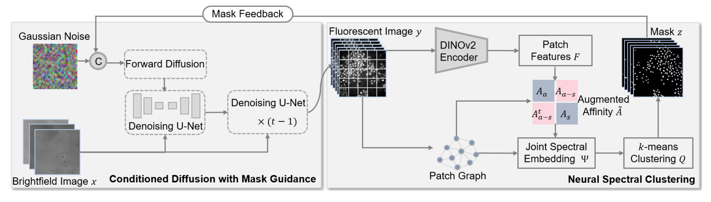

# DiffStain

This repository contains the official implementation of the research paper: 

**"DiffStain: Conditioned Diffusion-Based Semantic Virtual Staining with Mask Guidance"**



## Requirements and Installation
### System Requirements
+ Python version: 3.8 or higher
+ PyTorch version: 1.8.1 or higher

### Installation
+ To install the required Python packages, execute the following command: pip install -r requirements.txt

## Training
### Palette
The backbone of this implementation is based on [Janspiry/Palette-Image-to-Image-Diffusion-Models](https://github.com/Janspiry/Palette-Image-to-Image-Diffusion-Models) and is trained in the same way. We provide our .json file "cell_painting.json" which contains the hyperparameters used to train our models. This will require editing to suit the requirements of your file structures and datasets. You can then initiate training with the following commands:
```shell
cd palette
python run.py -p train -c config/cell_painting.json
```
### Finetuning Dino
The dino model needs to be finetuned on the cell painting dataset and the checkpoint pretrained on ImageNet is provided. You can start to finetune the dino model with the following commands:
```shell
cd DeepSC/dino
python finetune_dino.py --channel 1 --config_path './vits8Args.json'
```
In order to achieve a better effect of unsupervised deep neural spectral clustering, it is recommended to finetune 5 models on 5 channel images respectively to better learn the features of the 5 channels of fluorescence staining images.

## Testing
1. Generating preliminary virtual fluorescent staining images with Palette.
```shell
cd palette
python run.py -p test -c config/cell_painting.json
```
2. Using NSC to generate masks.
```shell
cd ../DeepSC
python run_deepsc -c config_dsm.json
```
3. Generating semantic virtual staining images with mask guidance. 
```shell
cd ../palette
python run.py -p test -c config/diffstain.json
```

## Acknowledge
our work is built upon the following projects, and uses a large amount of their code.
- [Janspiry/Palette-Image-to-Image-Diffusion-Models](https://github.com/Janspiry/Palette-Image-to-Image-Diffusion-Models)
- [facebookresearch/dino](https://github.com/facebookresearch/dino)